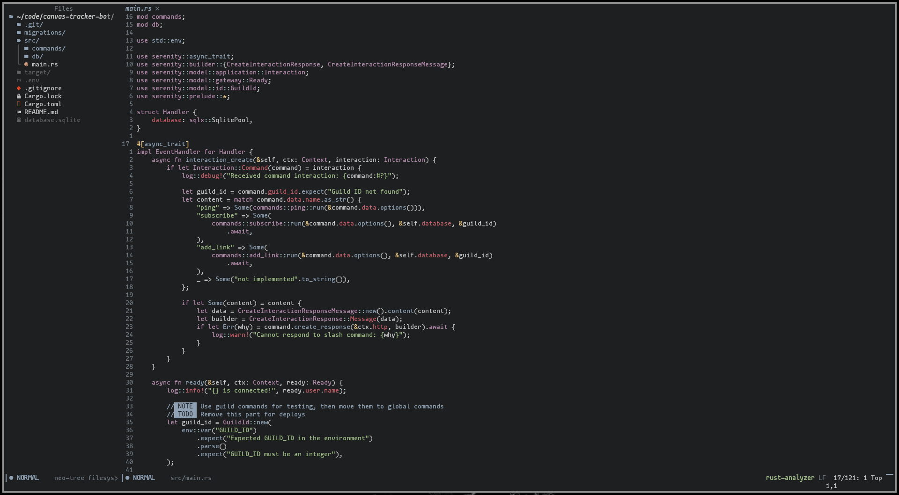
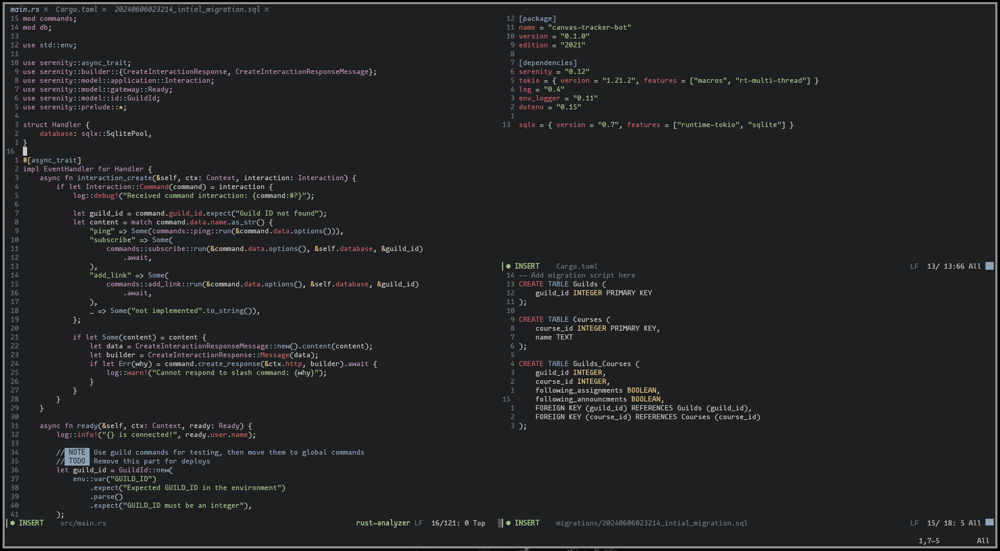
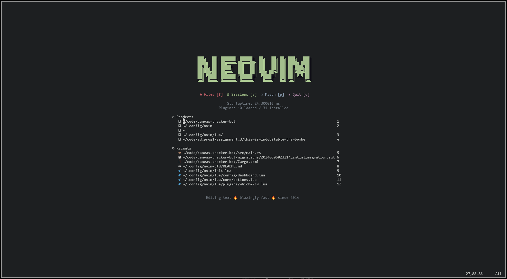
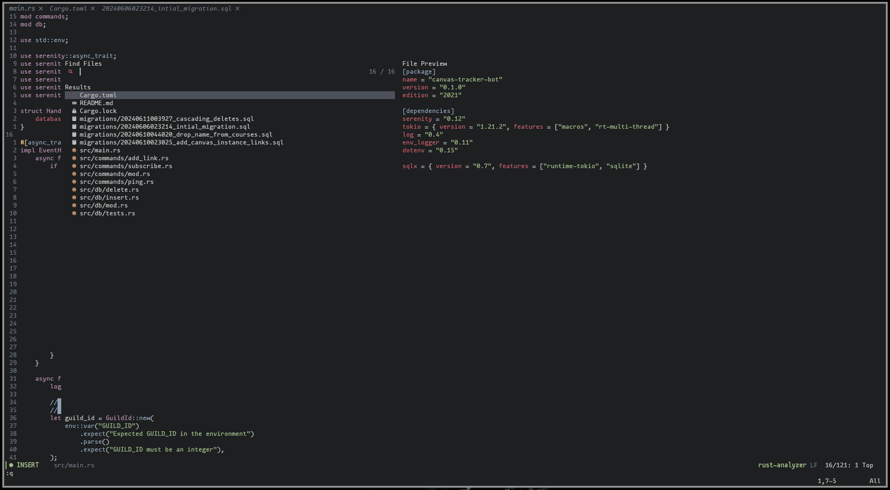
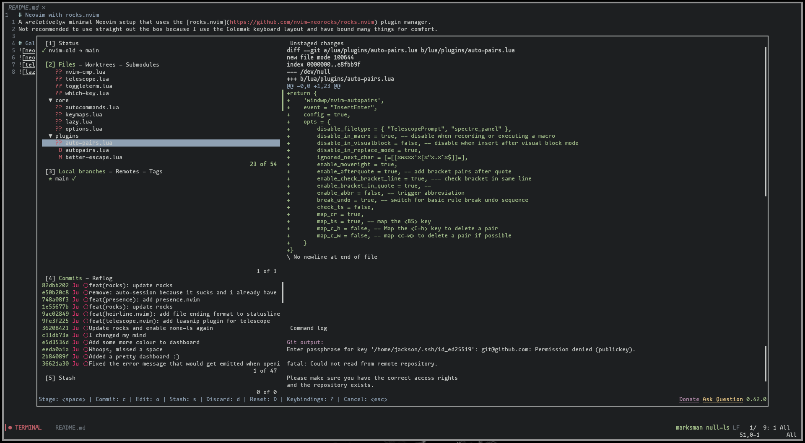

# Personal Neovim Setup
A *relatively* minimal Neovim setup that uses the lazy.nvim plugin manager.
Not recommended to use straight out the box because I use the Colemak keyboard layout and have bound many things for comfort.

# Gallery

